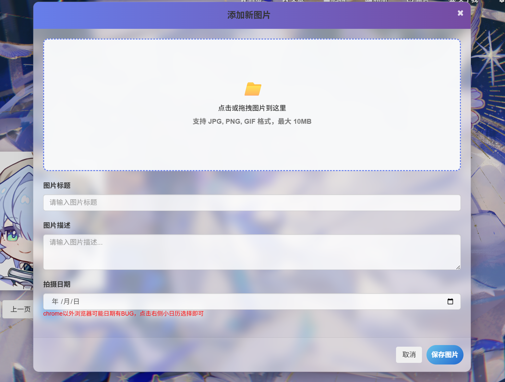
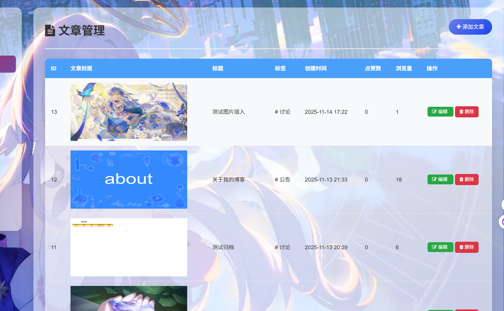
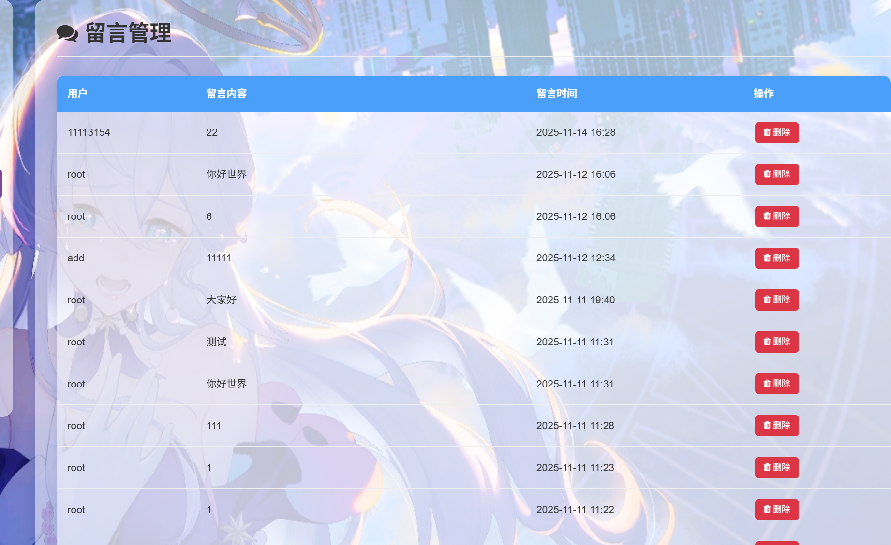
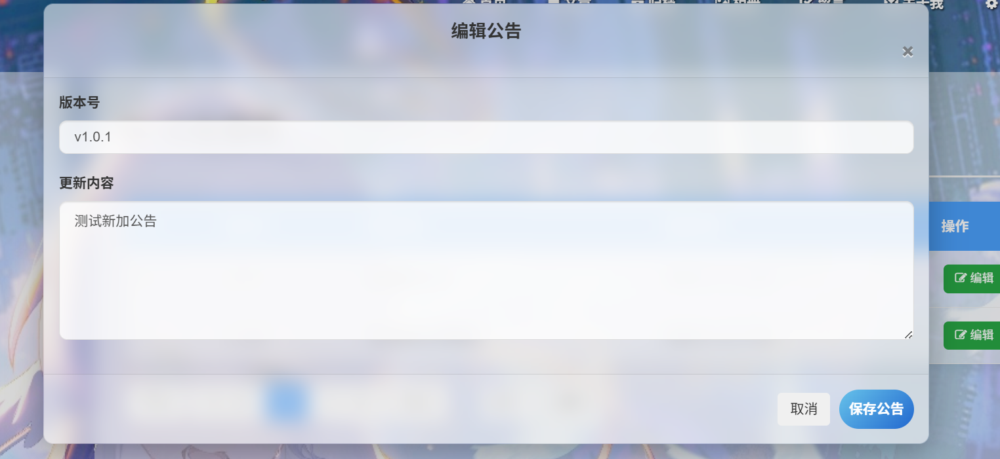
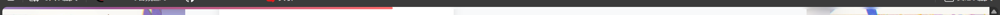

# 关于我的博客

## 技术栈

- 后端：Python+Django
- 前端：前端三件套+jquery框架（移动端不适配，PC和Pad可以正常浏览）
- 博客功能：登录、注册、留言、弹幕、markdown文章、文章评论、音乐盒、相册以及后台管理等

***推荐使用Edge或Chrome浏览器***

本博客为个人独立开发，接下来介绍一下本博客的全部功能~

---

## 首页

+ 首页导航栏采用fiexd布局，固定导航栏
+ 布局采用fullpage分页，下滑页面
+ 中间字符采用js打字机效果

### 登录&注册

+ 用户名密码会实时检测内容是否符合要求

  

### 音乐盒

点击后，自动播放音乐，小图标会自动旋转，播放完之后会自动下一首歌曲

## 文章中心

**点击标签可进入分类页面**

**搜索功能**

搜索会显示标题与内容与其相关的文章

### 文章详情页面

**文章目录**

采用markdown文章内容，目录根据内容标签动态生成

### markdown编辑器

因为截长图所以背景效果会受影响，主要展示一下功能

### 导入markdown功能

### 文章评论区

## 文章归档

归档每一年发布的文章

## 相册

记录生活中的美好瞬间~

点击可以查看详情大图

### 添加图片

## 留言板

### 弹幕

## 留言

## 个人设置

## 后台管理

### 数据概览

### 文章管理

### 用户管理

### 留言管理

### 相册管理

### 标签管理

### 公告管理&编辑

### 站点信息

## 越权访问

防止url拼接进入某些权限网站，设置了中间件功能

## 页面滑动进度条

---

以上就是本博客全部的功能了~
