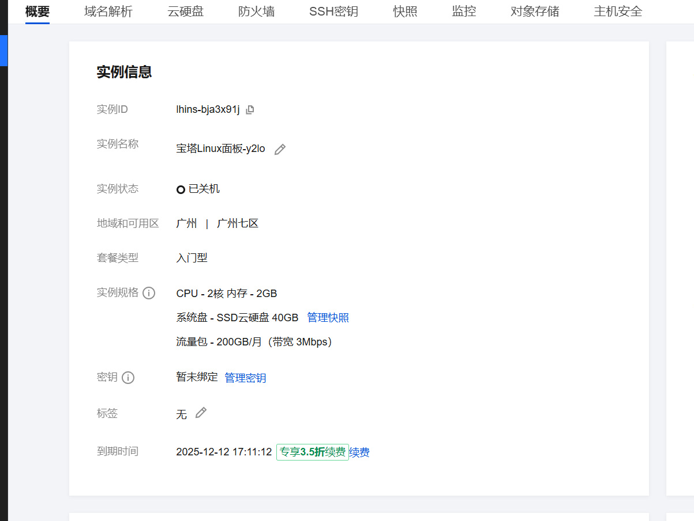
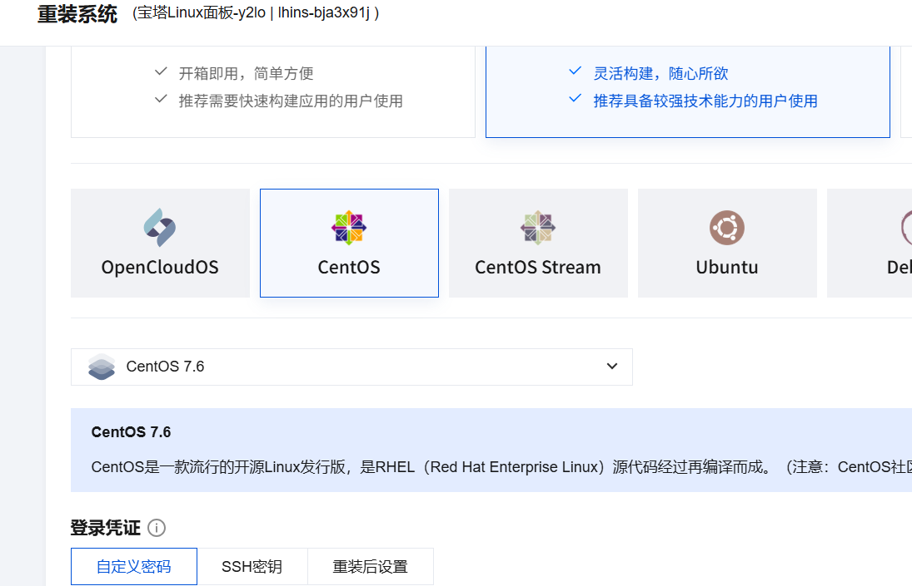
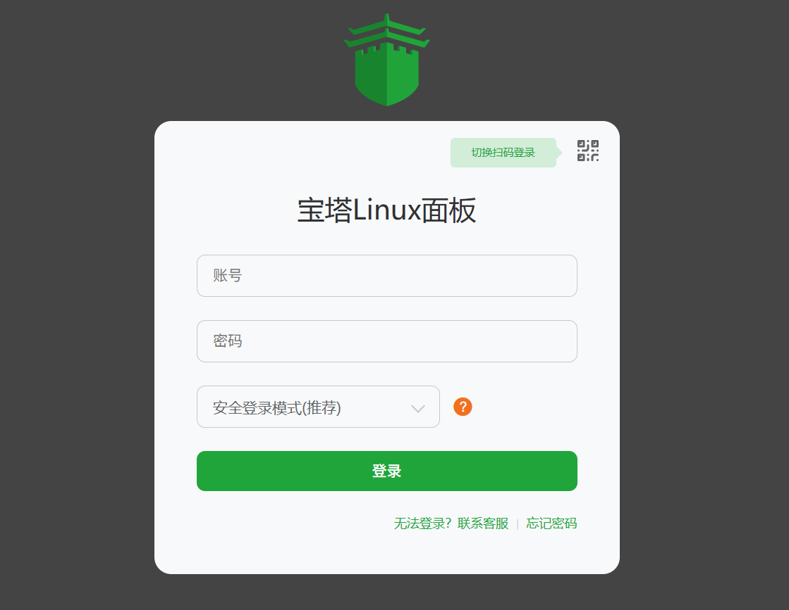
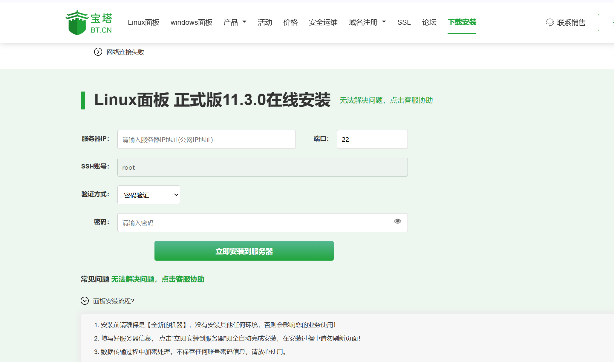
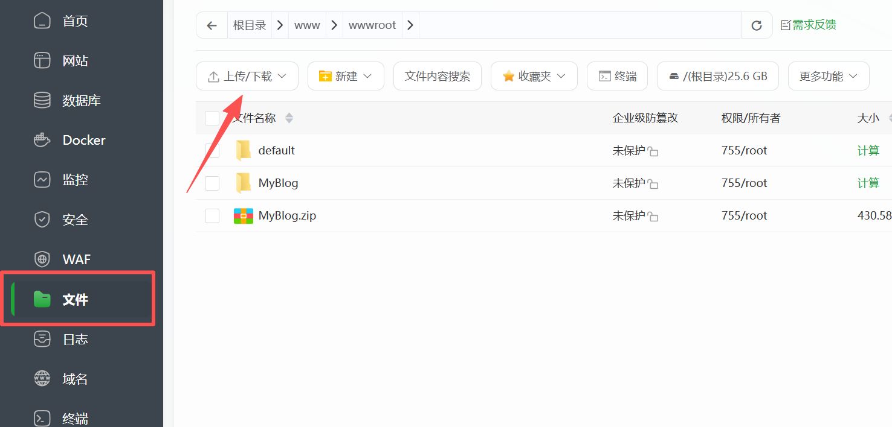
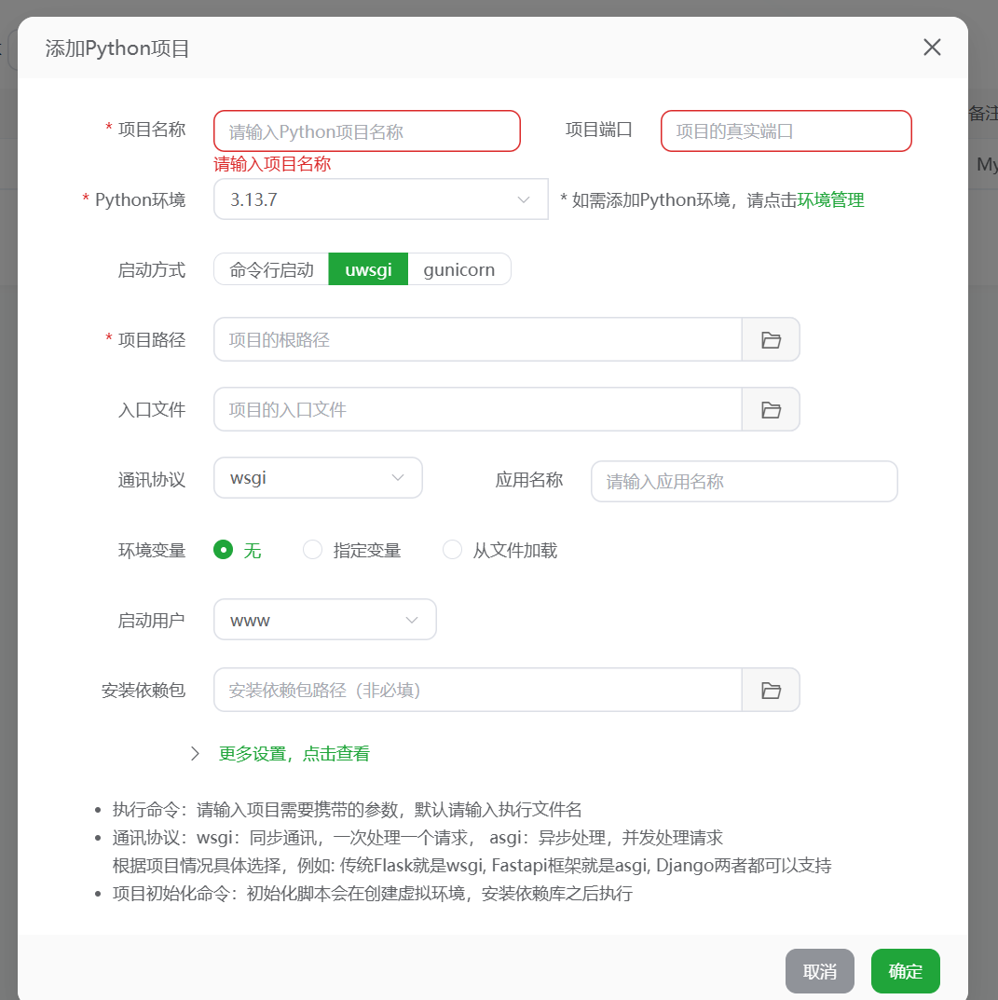
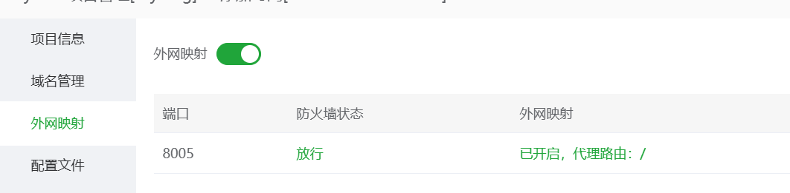
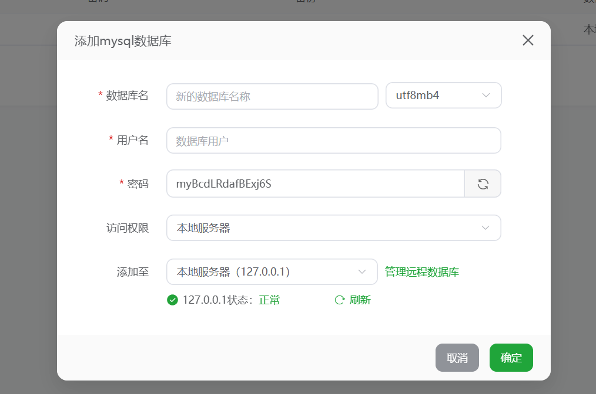
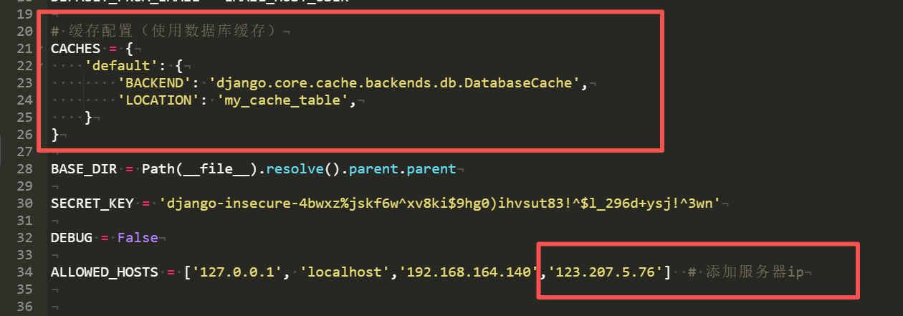
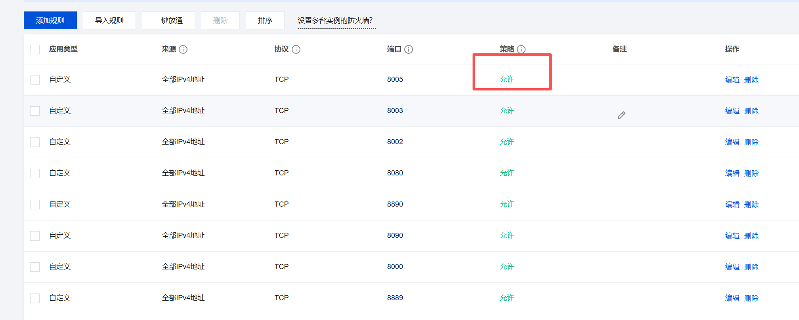

# 博客部署

## 聊一些部署遇到的困难

1. 首先，就是部署公网后，启动项目遇到的问题
   	+ Django版本过高，不适配数据库
   	+ 数据库版本过低导致数据库脚本无法导入
   	+ nginx端口占用，项目端口配置
   	+ 文件找不到丢失，网页404

2. 再者就是部署成功后，虽然成功但是失败，部分功能不能使用，网页加载过慢，部分font图标不显示，不适配chrome


## 准备工作

部署公网需要一台云服务器，我这里使用的是腾讯云配置是2核2G，因为挂服务器成本太高，就只租了一个月部署试一试hhhh= =



需要将服务器重装成CentOS 7.6 系统



**宝塔面板**

官网 https://www.bt.cn/new/index.html 





在服务器的终端输入命令安装或在线安装都可以，操作都简单

**安装成功后会弹出网址和账号密码，一定要牢牢记住。**


## 部署工作

### 文件上传

进入宝塔面板后，推荐安装的lamp一键安装即可。

将项目上传导入宝塔面板的文件内，并解压



### 添加项目

在网站选项中，点击python项目，添加项目



+ 项目名称：随便写即可 
+ 端口：随便写
+ python环境：选择项目所使用的版本，下载后建议创建虚拟环境，使用虚拟环境部署
+ 启动方式选择uwsgi
+ 通讯协议wsgi
+ 启动用户：root
+ 安装依赖包，现在项目文件下使用`pip freeze > requirements.txt` 输入命令，导出来所依赖包的文件，后会自动选择
+ 项目路径：选择自己项目即可
+ 域名如果有自己备案的域名可直接填写，没有就写服务器ip。
+ 外网映射必须开

#### 数据库

在宝塔面板点击数据库，添加对应的数据库名字密码等



### 文件配置

#### 项目文件配置

在项目设置添加文件local_settings.py，可以覆盖测试项目时的settings.py文件



需要在文件内添加缓存设置，如果有用到数据库缓存的话，其他缓存同理

DEBUG需要改为False，因为现在是要部署到公网上，不需要调试模式了。

在ALLOWED_HOSTS主机中添加服务器的ip地址。

#### nginx配置


端口监听listen 80，80要填写你项目的端口

第二框中，static，需要先在local_settings.py添加

```python
# 静态文件URL
STATIC_URL = '/static/'

# 收集静态文件的目标目录
STATIC_ROOT = os.path.join(BASE_DIR, 'staticfiles')  # staticfiles是生成静态文件目录名,可更改

STATICFILES_FINDERS = [
    'django.contrib.staticfiles.finders.FileSystemFinder',
    'django.contrib.staticfiles.finders.AppDirectoriesFinder',
]
```

然后在项目终端输入`python manage.py collectstatic` 然后就会在项目文件下生成staticfiles文件夹，里面存放着所有static文件


### 项目启动

启动项目前，记得把项目的端口和域名端口等等在防火墙中添加策略改为允许。



项目终端输入以下命令，导入数据库。

```python
python manage.py createcachetable django_cache_table #数据库缓存
python manage.py makemigrations
python manage.py migrate
```

在数据库这个地方，我是吃过很多坑了，要么就是数据库版本低，要么就是数据库脚本不符合，最后我选择用默认的文件数据库，这种比较傻，不太建议使用

```python
#默认写法可以创建sql文件，发送给朋友可以附带数据库
DATABASES = {
    'default': {
        'ENGINE': 'django.db.backends.sqlite3',
        'NAME': BASE_DIR / 'db.sqlite3',
    }
}
```

启动项目后就可以看到自己的网站了


## 本地部署

在项目命令行输入

```
pip install -r requirements.txt
```

安装所依赖的第三方模块

然后再输入

```python
python manage.py runserver
```

访问127.0.0.1网站即可

